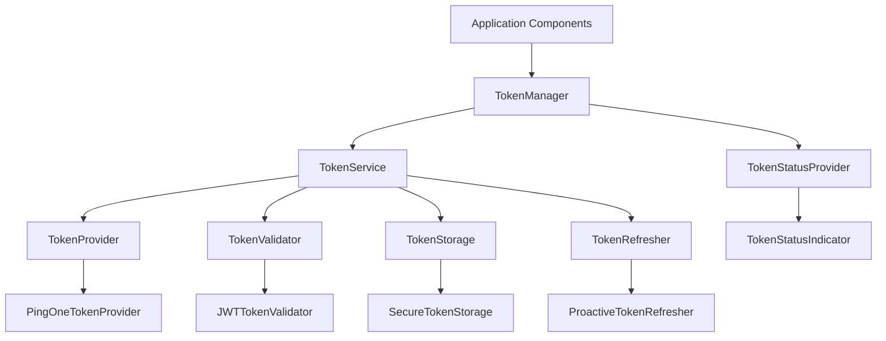
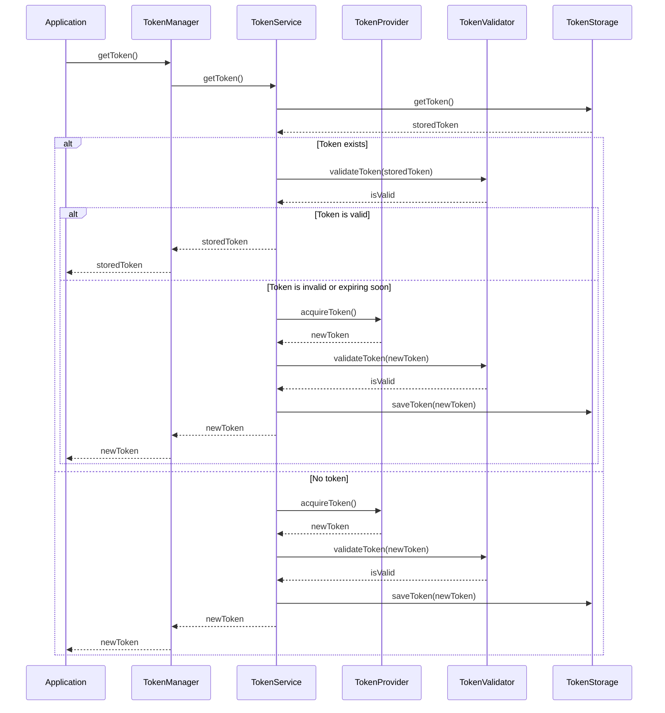
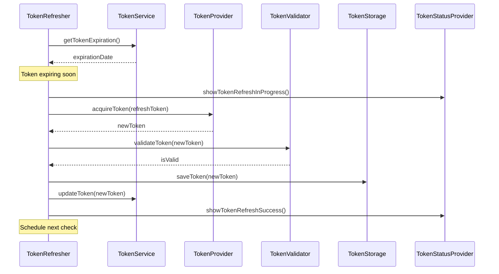

# Token Management Subsystem Design

## Overview

The Token Management Subsystem provides a centralized, secure, and consistent approach to token handling throughout the PingOne Import Tool. It replaces scattered token-related code with a robust framework that manages token acquisition, validation, refresh, storage, and status display. The subsystem is designed to be resilient to future changes in authentication requirements, ensuring that token management remains consistent regardless of how the application evolves.

## Architecture

The Token Management Subsystem follows a layered architecture with clear separation of concerns:



### Core Components

1. **TokenService**: The central service responsible for coordinating all token-related operations.
2. **TokenProvider**: Responsible for acquiring tokens from authentication sources.
3. **TokenValidator**: Validates tokens and checks their expiration status.
4. **TokenStorage**: Securely stores and retrieves tokens.
5. **TokenRefresher**: Handles token refresh operations, including proactive refresh.
6. **TokenManager**: High-level facade that provides a simplified interface to token functionality.
7. **TokenStatusProvider**: Manages token status display and user notifications.

## Components and Interfaces

### TokenService

The TokenService is the core component responsible for coordinating all token-related operations.

```typescript
interface TokenServiceOptions {
  autoRefreshThreshold?: number; // Seconds before expiration to trigger refresh
  refreshRetryLimit?: number;
  refreshRetryDelay?: number;
  tokenExpirationBuffer?: number; // Extra buffer to consider a token expired
}

class TokenService {
  constructor(
    private tokenProvider: TokenProvider,
    private tokenValidator: TokenValidator,
    private tokenStorage: TokenStorage,
    private tokenRefresher: TokenRefresher,
    private logger: LoggingService,
    private options: TokenServiceOptions = {}
  ) {
    // Initialize and set up token refresh monitoring
  }

  // Core token methods
  async getToken(forceRefresh = false): Promise<string>;
  async validateToken(token: string): Promise<boolean>;
  async refreshToken(): Promise<string>;
  
  // Token information methods
  getTokenExpiration(): Date | null;
  getTokenStatus(): TokenStatus;
  getTokenInfo(): TokenInfo | null;
  
  // Event handling
  onTokenRefresh(callback: (token: string) => void): void;
  onTokenExpired(callback: () => void): void;
  onTokenError(callback: (error: Error) => void): void;
}
```

### TokenProvider

The TokenProvider is responsible for acquiring tokens from authentication sources.

```typescript
interface TokenProviderOptions {
  clientId: string;
  clientSecret: string;
  environmentId: string;
  region: string;
  grantType?: string;
}

interface TokenProvider {
  acquireToken(credentials?: any): Promise<TokenResponse>;
}

class PingOneTokenProvider implements TokenProvider {
  constructor(
    private apiClient: ApiClient,
    private options: TokenProviderOptions
  ) {}

  async acquireToken(credentials?: any): Promise<TokenResponse>;
}
```

### TokenValidator

The TokenValidator validates tokens and checks their expiration status.

```typescript
interface TokenValidator {
  validateToken(token: string): Promise<boolean>;
  isTokenExpired(token: string): boolean;
  isTokenExpiringSoon(token: string, thresholdSeconds: number): boolean;
  getTokenExpiration(token: string): Date | null;
  getTokenClaims(token: string): any;
}

class JWTTokenValidator implements TokenValidator {
  validateToken(token: string): Promise<boolean>;
  isTokenExpired(token: string): boolean;
  isTokenExpiringSoon(token: string, thresholdSeconds: number): boolean;
  getTokenExpiration(token: string): Date | null;
  getTokenClaims(token: string): any;
}
```

### TokenStorage

The TokenStorage securely stores and retrieves tokens.

```typescript
interface TokenStorage {
  saveToken(token: string, tokenInfo: TokenInfo): Promise<void>;
  getToken(): Promise<string | null>;
  getTokenInfo(): Promise<TokenInfo | null>;
  clearToken(): Promise<void>;
}

class SecureTokenStorage implements TokenStorage {
  constructor(
    private encryptionService: EncryptionService,
    private storageKey: string = 'auth_token'
  ) {}

  async saveToken(token: string, tokenInfo: TokenInfo): Promise<void>;
  async getToken(): Promise<string | null>;
  async getTokenInfo(): Promise<TokenInfo | null>;
  async clearToken(): Promise<void>;
}
```

### TokenRefresher

The TokenRefresher handles token refresh operations, including proactive refresh.

```typescript
interface TokenRefresherOptions {
  refreshThreshold: number; // Seconds before expiration to trigger refresh
  retryLimit: number;
  retryDelay: number;
}

interface TokenRefresher {
  refreshToken(): Promise<TokenResponse>;
  startProactiveRefresh(): void;
  stopProactiveRefresh(): void;
}

class ProactiveTokenRefresher implements TokenRefresher {
  constructor(
    private tokenProvider: TokenProvider,
    private tokenValidator: TokenValidator,
    private tokenStorage: TokenStorage,
    private logger: LoggingService,
    private options: TokenRefresherOptions
  ) {}

  async refreshToken(): Promise<TokenResponse>;
  startProactiveRefresh(): void;
  stopProactiveRefresh(): void;
}
```

### TokenManager

The TokenManager provides a simplified facade for token operations.

```typescript
class TokenManager {
  constructor(
    private tokenService: TokenService,
    private tokenStatusProvider: TokenStatusProvider,
    private logger: LoggingService
  ) {}

  // High-level token operations
  async getToken(forceRefresh = false): Promise<string>;
  async ensureValidToken(): Promise<string>;
  
  // Status methods
  getTokenStatus(): TokenStatus;
  
  // Event handling
  onTokenStatusChange(callback: (status: TokenStatus) => void): void;
}
```

### TokenStatusProvider

The TokenStatusProvider manages token status display and user notifications.

```typescript
interface TokenStatusProviderOptions {
  updateInterval?: number; // Milliseconds between status updates
  showExpirationWarning?: boolean;
  warningThreshold?: number; // Seconds before expiration to show warning
}

class TokenStatusProvider {
  constructor(
    private tokenService: TokenService,
    private uiManager: UIManager,
    private logger: LoggingService,
    private options: TokenStatusProviderOptions = {}
  ) {}

  // Status display methods
  updateTokenStatus(): void;
  showTokenExpirationWarning(): void;
  showTokenExpiredError(): void;
  showTokenRefreshInProgress(): void;
  showTokenRefreshSuccess(): void;
  showTokenRefreshError(error: Error): void;
  
  // Control methods
  startStatusMonitoring(): void;
  stopStatusMonitoring(): void;
}
```

## Data Models

### Token Models

```typescript
enum TokenStatus {
  VALID = 'valid',
  EXPIRING_SOON = 'expiring_soon',
  EXPIRED = 'expired',
  REFRESHING = 'refreshing',
  ERROR = 'error',
  NONE = 'none'
}

interface TokenInfo {
  accessToken: string;
  refreshToken?: string;
  tokenType: string;
  expiresIn: number;
  expiresAt: Date;
  scope?: string;
  idToken?: string;
}

interface TokenResponse {
  access_token: string;
  refresh_token?: string;
  token_type: string;
  expires_in: number;
  scope?: string;
  id_token?: string;
}

interface TokenError {
  error: string;
  error_description?: string;
  status?: number;
}
```

## Token Flow

The token flow follows these steps:

1. **Request**: An application component requests a token from the TokenManager.
2. **Check**: The TokenService checks if a valid token exists in storage.
3. **Acquire**: If no valid token exists, the TokenProvider acquires a new token.
4. **Validate**: The TokenValidator validates the token.
5. **Store**: The TokenStorage securely stores the token.
6. **Return**: The token is returned to the requesting component.



## Token Refresh Flow

The token refresh flow follows these steps:

1. **Monitor**: The TokenRefresher monitors the token expiration.
2. **Detect**: When the token is about to expire, the TokenRefresher initiates a refresh.
3. **Refresh**: The TokenProvider acquires a new token using the refresh token.
4. **Validate**: The TokenValidator validates the new token.
5. **Store**: The TokenStorage securely stores the new token.
6. **Notify**: The TokenStatusProvider updates the token status display.



## Integration with Existing Systems

### API Client Integration

The TokenService integrates with the existing API client to make authentication requests:

```javascript
// Inside PingOneTokenProvider
async acquireToken(credentials) {
  const response = await this.apiClient.request('/as/token', {
    method: 'POST',
    headers: {
      'Content-Type': 'application/x-www-form-urlencoded'
    },
    body: new URLSearchParams({
      grant_type: this.options.grantType || 'client_credentials',
      client_id: this.options.clientId,
      client_secret: this.options.clientSecret
    })
  });
  
  if (!response.ok) {
    const errorData = await response.json();
    throw new TokenError(errorData.error, errorData.error_description, response.status);
  }
  
  return await response.json();
}
```

### UI Integration

The TokenStatusProvider integrates with the existing UI components to display token status:

```javascript
// Inside TokenStatusProvider
updateTokenStatus() {
  const status = this.tokenService.getTokenStatus();
  const statusIndicator = document.getElementById('token-status-indicator');
  
  if (!statusIndicator) {
    this.logger.warn('Token status indicator element not found');
    return;
  }
  
  // Clear existing classes
  statusIndicator.classList.remove('valid', 'expiring', 'expired', 'refreshing', 'error');
  
  // Add appropriate class
  switch (status) {
    case TokenStatus.VALID:
      statusIndicator.classList.add('valid');
      statusIndicator.textContent = 'Token Valid';
      break;
    case TokenStatus.EXPIRING_SOON:
      statusIndicator.classList.add('expiring');
      statusIndicator.textContent = 'Token Expiring Soon';
      break;
    case TokenStatus.EXPIRED:
      statusIndicator.classList.add('expired');
      statusIndicator.textContent = 'Token Expired';
      break;
    case TokenStatus.REFRESHING:
      statusIndicator.classList.add('refreshing');
      statusIndicator.textContent = 'Refreshing Token...';
      break;
    case TokenStatus.ERROR:
      statusIndicator.classList.add('error');
      statusIndicator.textContent = 'Token Error';
      break;
    case TokenStatus.NONE:
      statusIndicator.textContent = 'No Token';
      break;
  }
}
```

### Error Handling Integration

The TokenService integrates with the Error Handling and Logging Subsystem:

```javascript
// Inside TokenService
async getToken(forceRefresh = false) {
  try {
    // Token acquisition logic
  } catch (error) {
    this.logger.error('Failed to get token', { error });
    
    // Use ErrorManager if available
    if (this.errorManager) {
      this.errorManager.handleError(error, {
        component: 'TokenService',
        operation: 'getToken',
        forceRefresh
      });
    }
    
    throw error;
  }
}
```

## Token Security

### Secure Storage

The TokenStorage uses secure storage mechanisms to protect tokens:

```javascript
// Inside SecureTokenStorage
async saveToken(token, tokenInfo) {
  try {
    // Encrypt the token
    const encryptedToken = await this.encryptionService.encrypt(token);
    
    // Store the encrypted token
    localStorage.setItem(this.storageKey, encryptedToken);
    
    // Store token info separately
    localStorage.setItem(`${this.storageKey}_info`, JSON.stringify({
      expiresAt: tokenInfo.expiresAt.toISOString(),
      tokenType: tokenInfo.tokenType,
      scope: tokenInfo.scope
    }));
  } catch (error) {
    throw new Error(`Failed to save token: ${error.message}`);
  }
}
```

### Token Validation

The TokenValidator performs comprehensive validation of tokens:

```javascript
// Inside JWTTokenValidator
validateToken(token) {
  try {
    // Parse the token
    const parts = token.split('.');
    if (parts.length !== 3) {
      return false;
    }
    
    // Decode the payload
    const payload = JSON.parse(atob(parts[1]));
    
    // Check expiration
    const now = Math.floor(Date.now() / 1000);
    if (payload.exp && payload.exp < now) {
      return false;
    }
    
    // Check issuer (optional)
    if (this.options.issuer && payload.iss !== this.options.issuer) {
      return false;
    }
    
    // Check audience (optional)
    if (this.options.audience && payload.aud !== this.options.audience) {
      return false;
    }
    
    return true;
  } catch (error) {
    return false;
  }
}
```

## Future-Proofing

### Abstraction Layers

The subsystem uses abstraction layers to isolate changes:

1. **Interfaces**: All components are defined with interfaces, allowing for alternative implementations.
2. **Dependency Injection**: Components accept dependencies via constructor injection, making them easy to replace.
3. **Facade Pattern**: The TokenManager provides a simplified interface that can remain stable even if the underlying implementation changes.

### Extensibility Points

The subsystem provides several extension points:

1. **Custom Token Providers**: New authentication sources can be added by implementing the TokenProvider interface.
2. **Custom Token Validators**: New validation rules can be added by implementing the TokenValidator interface.
3. **Custom Token Storage**: New storage mechanisms can be added by implementing the TokenStorage interface.
4. **Custom Token Refreshers**: New refresh strategies can be added by implementing the TokenRefresher interface.

### Configuration

The subsystem is highly configurable to adapt to changing requirements:

1. **Refresh Thresholds**: The time before expiration to trigger a refresh can be configured.
2. **Retry Strategies**: The number of retries and delay between retries can be configured.
3. **Storage Options**: The storage mechanism and encryption can be configured.
4. **Validation Rules**: The validation rules can be configured for different token types.

## Testing Strategy

### Unit Testing

Each component will have comprehensive unit tests:

1. **TokenService**: Tests for token acquisition, validation, and refresh.
2. **TokenProvider**: Tests for token acquisition from different sources.
3. **TokenValidator**: Tests for token validation and expiration checking.
4. **TokenStorage**: Tests for secure storage and retrieval.
5. **TokenRefresher**: Tests for token refresh strategies.
6. **TokenManager**: Tests for the facade methods.
7. **TokenStatusProvider**: Tests for status display and notifications.

### Integration Testing

Integration tests will verify the interaction between components:

1. **TokenService + TokenProvider**: Tests for token acquisition.
2. **TokenService + TokenValidator**: Tests for token validation.
3. **TokenService + TokenStorage**: Tests for token storage and retrieval.
4. **TokenService + TokenRefresher**: Tests for token refresh.
5. **TokenManager + TokenStatusProvider**: Tests for status updates.

### End-to-End Testing

End-to-end tests will verify the complete token flow:

1. **Token Acquisition Flow**: Tests for the complete flow from request to return.
2. **Token Refresh Flow**: Tests for the complete flow from detection to notification.
3. **Error Handling Flow**: Tests for error scenarios and recovery.

## Implementation Plan

The implementation will follow these phases:

1. **Core Components**: Implement the core TokenService, TokenProvider, TokenValidator, and TokenStorage.
2. **Refresh Mechanism**: Implement the TokenRefresher with proactive refresh.
3. **Status Display**: Implement the TokenStatusProvider for UI integration.
4. **Facade**: Implement the TokenManager facade.
5. **Integration**: Integrate with existing API client, UI components, and Error Handling and Logging Subsystem.
6. **Migration**: Update existing code to use the new subsystem.
7. **Testing**: Add comprehensive tests for all components.
8. **Documentation**: Create thorough documentation for the subsystem.