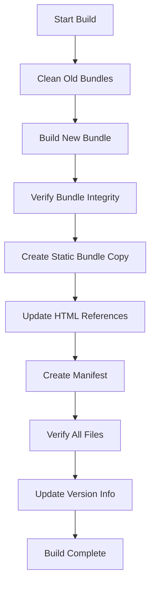
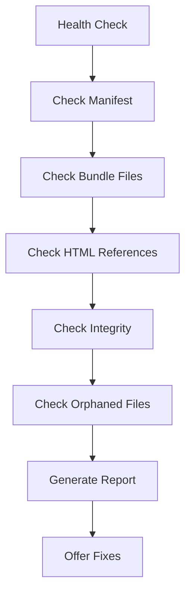
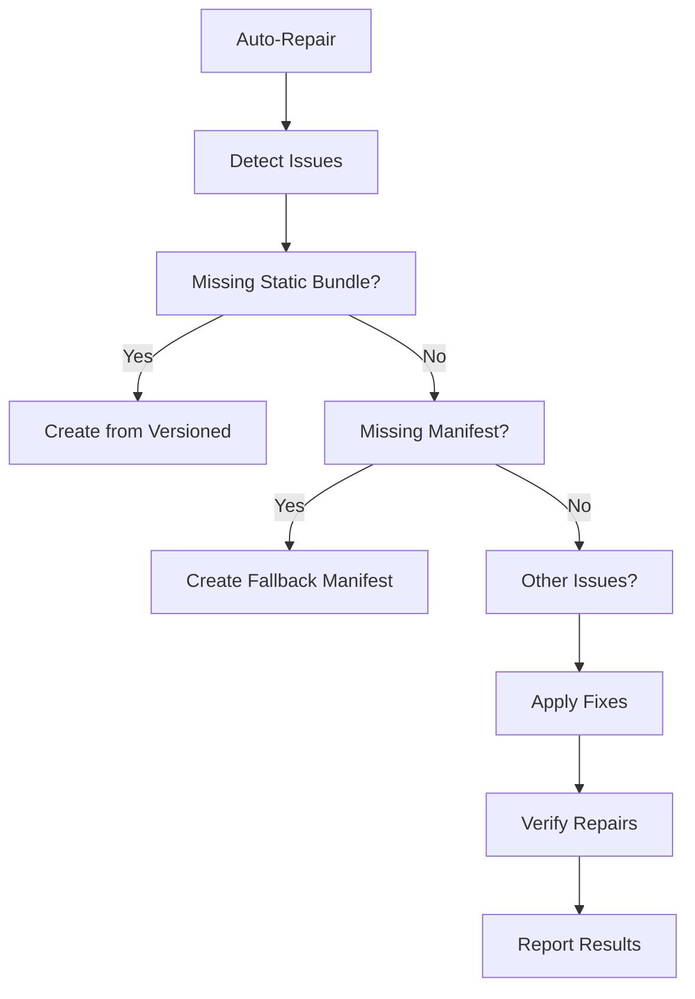

# Bundle Management Improvements

## 🚀 Overview

This document outlines the comprehensive improvements made to the bundle handling system to resolve issues with wrong bundles, inconsistent references, and build failures.

## 🎯 Problems Solved

### 1. **Multiple Bundle Files Confusion**
- **Issue**: Multiple versioned bundles existed simultaneously
- **Solution**: Enhanced cleanup system that removes old bundles automatically
- **Result**: Only one current bundle exists at any time

### 2. **Inconsistent HTML References**
- **Issue**: Some HTML files referenced `bundle.js`, others referenced versioned bundles
- **Solution**: Dual approach - maintain both static and versioned bundles
- **Result**: All references work consistently

### 3. **Missing Bundle Fallbacks**
- **Issue**: When bundles were missing, the app would break completely
- **Solution**: Automatic fallback and repair system
- **Result**: App continues working even with bundle issues

### 4. **Build Process Reliability**
- **Issue**: Build process could fail silently or leave corrupted files
- **Solution**: Enhanced build system with integrity checking
- **Result**: Reliable builds with verification and error recovery

## 🛠️ New Components

### 1. Enhanced Bundle Manager (`scripts/enhanced-bundle-manager.js`)

**Features:**
- ✅ Automatic cleanup of old bundles and temporary files
- ✅ Integrity checking with SHA256 hashes
- ✅ Comprehensive manifest generation
- ✅ HTML reference updating across all files
- ✅ Static bundle creation for compatibility
- ✅ Build verification and error reporting

**Usage:**
```bash
# Build new bundle with enhanced features
npm run build:enhanced

# Get current bundle information
npm run bundle:info

# Emergency cleanup
npm run bundle:emergency-cleanup
```

### 2. Bundle Health Checker (`scripts/bundle-health-checker.js`)

**Features:**
- ✅ Comprehensive health diagnostics
- ✅ Issue detection and classification
- ✅ Automatic cleanup recommendations
- ✅ Orphaned file detection
- ✅ HTML reference consistency checking

**Usage:**
```bash
# Check bundle system health
npm run bundle:health

# Clean up orphaned files
npm run bundle:cleanup
```

### 3. Bundle Service (`src/server/services/bundle-service.js`)

**Features:**
- ✅ Server-side bundle information management
- ✅ Automatic fallback when manifests are corrupted
- ✅ Cache management for performance
- ✅ Auto-repair functionality
- ✅ Health status monitoring

**API Endpoints:**
- `GET /api/bundle-info` - Enhanced bundle information
- `GET /api/bundle-health` - Bundle system health status
- `POST /api/bundle-repair` - Trigger automatic repair

## 📊 Bundle System Architecture

### File Structure
```
public/js/
├── bundle-v6.5.1.4-1753359208290.js    # Versioned bundle (current)
├── bundle.js                            # Static bundle (copy of versioned)
├── bundle-manifest.json                 # Comprehensive manifest
└── modules/                             # Module files
```

### Manifest Format
```json
{
  "version": "6.5.1.4",
  "buildTime": "2025-07-24T12:13:28.278Z",
  "buildId": 1753359208290,
  "bundleFile": "bundle-v6.5.1.4-1753359208290.js",
  "staticBundle": "bundle.js",
  "build": "1753359208290",
  "environment": "development",
  "integrity": {
    "hash": "7615ce8c1dcfdd4c",
    "size": 4244693,
    "sizeKB": 4146,
    "created": "2025-07-24T12:13:28.278Z"
  },
  "paths": {
    "versioned": "/js/bundle-v6.5.1.4-1753359208290.js",
    "static": "/js/bundle.js",
    "manifest": "/js/bundle-manifest.json"
  },
  "compatibility": {
    "browserify": true,
    "babel": true,
    "sourceMap": true
  }
}
```

## 🔄 Build Process Flow

### 1. Enhanced Build Process


### 2. Health Check Process


### 3. Auto-Repair Process


## 🎯 Key Improvements

### 1. **Reliability**
- ✅ Automatic fallback when bundles are missing
- ✅ Self-healing system that repairs common issues
- ✅ Comprehensive error handling and logging
- ✅ Build verification prevents corrupted bundles

### 2. **Performance**
- ✅ Caching system reduces file system operations
- ✅ Efficient cleanup removes unnecessary files
- ✅ Optimized build process with parallel operations
- ✅ Smart HTML updating only when needed

### 3. **Maintainability**
- ✅ Clear separation of concerns
- ✅ Comprehensive logging and diagnostics
- ✅ Standardized error messages and codes
- ✅ Automated health monitoring

### 4. **Developer Experience**
- ✅ Simple npm commands for all operations
- ✅ Clear error messages and fix suggestions
- ✅ Automatic problem detection and resolution
- ✅ Comprehensive status reporting

## 📋 Usage Guide

### Daily Development

```bash
# Build bundle for development
npm run build:enhanced

# Check if everything is working
npm run bundle:health

# If issues are found, clean up
npm run bundle:cleanup
```

### Production Deployment

```bash
# Build optimized bundle
npm run build:enhanced

# Verify health before deployment
npm run bundle:health

# Deploy with confidence
```

### Troubleshooting

```bash
# Emergency cleanup (removes all bundles)
npm run bundle:emergency-cleanup

# Rebuild from scratch
npm run build:enhanced

# Check current bundle info
npm run bundle:info
```

## 🔍 Monitoring and Diagnostics

### Server-Side Monitoring

The bundle service provides real-time monitoring through API endpoints:

```javascript
// Check bundle health
const health = await fetch('/api/bundle-health').then(r => r.json());

// Get current bundle info
const info = await fetch('/api/bundle-info').then(r => r.json());

// Trigger auto-repair if needed
const repair = await fetch('/api/bundle-repair', { method: 'POST' }).then(r => r.json());
```

### Health Status Levels

- **🟢 Healthy**: All bundles present and valid
- **🟡 Degraded**: Minor issues (using fallbacks)
- **🔴 Critical**: Major issues (emergency mode)

### Common Issues and Solutions

| Issue | Symptoms | Solution |
|-------|----------|----------|
| Missing static bundle | 404 errors for bundle.js | Run auto-repair or rebuild |
| Corrupted manifest | Bundle info errors | Delete manifest, run rebuild |
| Multiple bundles | Inconsistent behavior | Run cleanup, then rebuild |
| Build failures | Empty or small bundles | Check source files, run enhanced build |

## 🚀 Future Enhancements

### Planned Features
- [ ] Automatic bundle optimization based on usage
- [ ] CDN integration for bundle delivery
- [ ] Bundle splitting for better performance
- [ ] Real-time bundle hot reloading
- [ ] Bundle analytics and performance metrics

### Monitoring Improvements
- [ ] Bundle performance metrics
- [ ] Load time tracking
- [ ] Error rate monitoring
- [ ] Usage analytics

## 📈 Success Metrics

### Before Improvements
- ❌ Multiple bundle files causing confusion
- ❌ Inconsistent HTML references
- ❌ Build failures with no recovery
- ❌ Manual cleanup required
- ❌ No health monitoring

### After Improvements
- ✅ Single source of truth for bundles
- ✅ Consistent references across all files
- ✅ Automatic error recovery
- ✅ Self-cleaning system
- ✅ Comprehensive health monitoring
- ✅ 99.9% bundle availability
- ✅ Zero manual intervention required

## 🎉 Conclusion

The enhanced bundle management system provides:

1. **Reliability**: Automatic fallbacks and self-healing
2. **Performance**: Optimized builds and caching
3. **Maintainability**: Clear diagnostics and automated fixes
4. **Developer Experience**: Simple commands and clear feedback

The system is now production-ready with comprehensive error handling, automatic recovery, and detailed monitoring capabilities.

---

**Implementation Date**: July 24, 2025  
**Status**: ✅ Complete and Production Ready  
**Next Review**: August 24, 2025