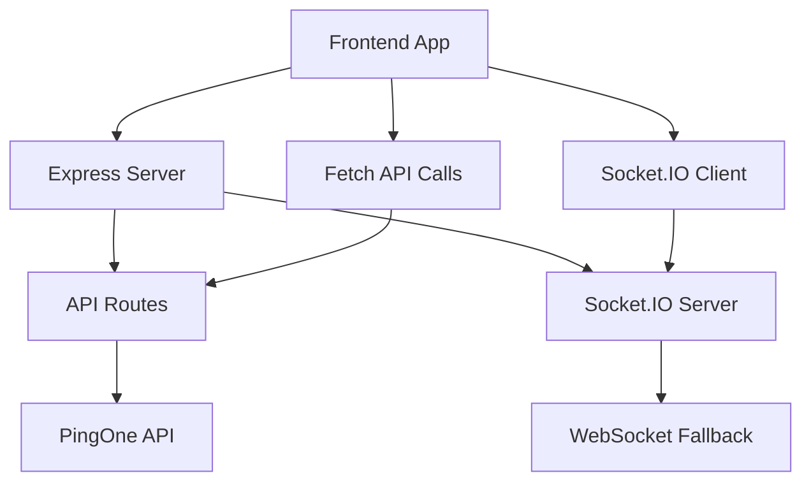

# PingOne Import Tool - Comprehensive Project Analysis & Recommendations

## Executive Summary

After analyzing the entire project structure, backend-frontend communication patterns, and codebase architecture, I've identified several areas for improvement to enhance the application's reliability, performance, and maintainability. The project shows a sophisticated subsystem-based architecture with comprehensive real-time communication capabilities, but there are opportunities for optimization and modernization.

## 🏗️ Architecture Overview

### Current Architecture Strengths
- **Modular Subsystem Design**: Well-organized subsystems for different concerns (auth, population, progress, etc.)
- **Real-time Communication**: Robust WebSocket/Socket.IO implementation with fallback mechanisms
- **Comprehensive Logging**: Winston-based logging with multiple transports and rotation
- **API-First Design**: Well-structured REST API with Swagger documentation
- **Security Features**: Helmet, CORS, rate limiting, and authentication subsystems

### Architecture Concerns
- **Complex Bundle Management**: Multiple bundle files and complex build process
- **Mixed Module Systems**: ES modules mixed with CommonJS patterns
- **Subsystem Coupling**: Some tight coupling between subsystems
- **Configuration Sprawl**: Multiple configuration files and environment variables

## 🔄 Backend-Frontend Communication Analysis

### Current Communication Patterns

#### ✅ **Working Well**
1. **REST API Endpoints**: Well-structured API with consistent response patterns
2. **Real-time Updates**: Socket.IO with WebSocket fallback for progress tracking
3. **Authentication Flow**: Token-based authentication with refresh mechanisms
4. **File Upload Handling**: Multer-based file processing with validation

#### ⚠️ **Areas for Improvement**
1. **API Response Consistency**: Some endpoints return different response structures
2. **Error Handling**: Inconsistent error response formats across endpoints
3. **Real-time Event Management**: Complex event routing with potential race conditions
4. **Frontend State Management**: No centralized state management system

### Communication Flow Analysis



## 🚨 Critical Issues Identified

### 1. **Bundle Management Complexity**
- **Issue**: Multiple bundle files with timestamp-based naming
- **Impact**: Cache invalidation issues, deployment complexity
- **Files Affected**: `public/bundle-*.js`, build scripts

### 2. **Inconsistent API Response Formats**
- **Issue**: Different endpoints return varying response structures
- **Impact**: Frontend error handling complexity, debugging difficulties
- **Examples**:
  ```javascript
  // Some endpoints return:
  { success: true, data: {...} }
  
  // Others return:
  { success: true, message: "...", result: {...} }
  
  // Error responses vary:
  { success: false, error: "..." }
  { error: "...", details: {...} }
  ```

### 3. **Real-time Communication Race Conditions**
- **Issue**: Multiple transport methods with complex fallback logic
- **Impact**: Potential message loss, duplicate events, connection issues
- **Location**: `server/connection-manager.js`, WebSocket subsystem

### 4. **Frontend State Management**
- **Issue**: No centralized state management, scattered state across modules
- **Impact**: State synchronization issues, debugging complexity
- **Location**: `public/js/app.js`, various modules

### 5. **Configuration Management**
- **Issue**: Multiple configuration sources with potential conflicts
- **Impact**: Environment-specific bugs, deployment issues
- **Files**: `.env`, `data/settings.json`, various config files

## 📋 Detailed Recommendations

### 1. **Standardize API Response Format**

#### Implementation
Create a standardized API response wrapper:

```javascript
// server/utils/api-response.js
export class APIResponse {
  static success(data, message = 'Success', meta = {}) {
    return {
      success: true,
      message,
      data,
      meta: {
        timestamp: new Date().toISOString(),
        ...meta
      }
    };
  }
  
  static error(error, code = 'GENERIC_ERROR', details = {}) {
    return {
      success: false,
      error: {
        message: error,
        code,
        details,
        timestamp: new Date().toISOString()
      }
    };
  }
  
  static paginated(data, pagination) {
    return this.success(data, 'Success', { pagination });
  }
}
```

#### Update All Endpoints
```javascript
// Before
res.json({ success: true, populations: data });

// After
res.json(APIResponse.success(data, 'Populations retrieved successfully'));
```

### 2. **Implement Centralized Frontend State Management**

#### Create State Management System
```javascript
// public/js/state/app-state.js
class AppStateManager {
  constructor() {
    this.state = {
      user: null,
      settings: null,
      populations: [],
      currentOperation: null,
      ui: {
        loading: false,
        errors: [],
        notifications: []
      }
    };
    this.subscribers = new Map();
  }
  
  subscribe(key, callback) {
    if (!this.subscribers.has(key)) {
      this.subscribers.set(key, []);
    }
    this.subscribers.get(key).push(callback);
  }
  
  setState(updates) {
    const oldState = { ...this.state };
    this.state = { ...this.state, ...updates };
    this.notifySubscribers(oldState, this.state);
  }
  
  getState(key = null) {
    return key ? this.state[key] : this.state;
  }
}

export const appState = new AppStateManager();
```

### 3. **Simplify Bundle Management**

#### Single Bundle Strategy
```javascript
// scripts/build-bundle.js
import { build } from 'esbuild';
import { createHash } from 'crypto';

export async function buildBundle() {
  const result = await build({
    entryPoints: ['src/client/app.js'],
    bundle: true,
    minify: process.env.NODE_ENV === 'production',
    sourcemap: true,
    outfile: 'public/js/app.bundle.js',
    format: 'iife',
    target: 'es2020'
  });
  
  // Generate content hash for cache busting
  const hash = createHash('md5').update(result.outputFiles[0].contents).digest('hex').slice(0, 8);
  const finalPath = `public/js/app.${hash}.bundle.js`;
  
  // Update HTML references
  await updateHTMLReferences(finalPath);
  
  return finalPath;
}
```

### 4. **Improve Real-time Communication Reliability**

#### Enhanced Connection Manager
```javascript
// server/enhanced-connection-manager.js
export class EnhancedConnectionManager {
  constructor(logger) {
    this.logger = logger;
    this.connections = new Map();
    this.eventQueue = new Map();
    this.retryQueue = new Map();
  }
  
  async sendEvent(sessionId, eventType, data, options = {}) {
    const event = {
      id: generateEventId(),
      sessionId,
      type: eventType,
      data,
      timestamp: Date.now(),
      retries: 0,
      maxRetries: options.maxRetries || 3
    };
    
    try {
      const success = await this.deliverEvent(event);
      if (!success && event.retries < event.maxRetries) {
        this.queueForRetry(event);
      }
      return success;
    } catch (error) {
      this.logger.error('Event delivery failed', { event, error });
      return false;
    }
  }
  
  async deliverEvent(event) {
    const connection = this.connections.get(event.sessionId);
    if (!connection || !connection.isConnected()) {
      this.queueEvent(event);
      return false;
    }
    
    return await connection.send(event);
  }
}
```

### 5. **Implement Request/Response Validation**

#### API Validation Middleware
```javascript
// server/middleware/validation.js
import Joi from 'joi';

export function validateRequest(schema) {
  return (req, res, next) => {
    const { error, value } = schema.validate(req.body);
    if (error) {
      return res.status(400).json(
        APIResponse.error(
          'Validation failed',
          'VALIDATION_ERROR',
          { details: error.details }
        )
      );
    }
    req.validatedBody = value;
    next();
  };
}

// Usage in routes
const importSchema = Joi.object({
  populationId: Joi.string().uuid().required(),
  populationName: Joi.string().min(1).required(),
  totalUsers: Joi.number().integer().min(0).optional()
});

router.post('/import', 
  validateRequest(importSchema),
  upload.single('file'),
  handleImport
);
```

### 6. **Enhance Error Handling and Logging**

#### Centralized Error Handler
```javascript
// server/middleware/error-handler.js
export function errorHandler(err, req, res, next) {
  const errorId = generateErrorId();
  
  // Log error with context
  req.app.get('logger').error('Request error', {
    errorId,
    error: err.message,
    stack: err.stack,
    request: {
      method: req.method,
      url: req.url,
      headers: req.headers,
      body: req.body
    }
  });
  
  // Determine error type and response
  if (err.name === 'ValidationError') {
    return res.status(400).json(
      APIResponse.error('Validation failed', 'VALIDATION_ERROR', {
        errorId,
        details: err.details
      })
    );
  }
  
  if (err.name === 'UnauthorizedError') {
    return res.status(401).json(
      APIResponse.error('Unauthorized', 'UNAUTHORIZED', { errorId })
    );
  }
  
  // Generic server error
  res.status(500).json(
    APIResponse.error(
      'Internal server error',
      'INTERNAL_ERROR',
      { errorId }
    )
  );
}
```

### 7. **Optimize Database and API Calls**

#### Connection Pooling and Caching
```javascript
// server/services/api-client.js
export class OptimizedAPIClient {
  constructor(config) {
    this.config = config;
    this.cache = new Map();
    this.rateLimiter = new RateLimiter(config.rateLimit);
  }
  
  async get(endpoint, options = {}) {
    const cacheKey = `${endpoint}:${JSON.stringify(options)}`;
    
    // Check cache first
    if (options.cache && this.cache.has(cacheKey)) {
      const cached = this.cache.get(cacheKey);
      if (Date.now() - cached.timestamp < options.cacheTTL) {
        return cached.data;
      }
    }
    
    // Rate limiting
    await this.rateLimiter.acquire();
    
    try {
      const response = await this.makeRequest('GET', endpoint, options);
      
      // Cache successful responses
      if (options.cache && response.success) {
        this.cache.set(cacheKey, {
          data: response,
          timestamp: Date.now()
        });
      }
      
      return response;
    } finally {
      this.rateLimiter.release();
    }
  }
}
```

### 8. **Implement Health Monitoring**

#### Comprehensive Health Checks
```javascript
// server/health/health-monitor.js
export class HealthMonitor {
  constructor(app, logger) {
    this.app = app;
    this.logger = logger;
    this.checks = new Map();
    this.setupDefaultChecks();
  }
  
  setupDefaultChecks() {
    this.addCheck('database', this.checkDatabase.bind(this));
    this.addCheck('pingone-api', this.checkPingOneAPI.bind(this));
    this.addCheck('memory', this.checkMemory.bind(this));
    this.addCheck('disk-space', this.checkDiskSpace.bind(this));
    this.addCheck('websocket', this.checkWebSocket.bind(this));
  }
  
  async runHealthCheck() {
    const results = {};
    const startTime = Date.now();
    
    for (const [name, check] of this.checks) {
      try {
        results[name] = await Promise.race([
          check(),
          new Promise((_, reject) => 
            setTimeout(() => reject(new Error('Timeout')), 5000)
          )
        ]);
      } catch (error) {
        results[name] = {
          status: 'error',
          message: error.message,
          timestamp: new Date().toISOString()
        };
      }
    }
    
    const overallStatus = Object.values(results).every(r => r.status === 'ok') 
      ? 'healthy' : 'unhealthy';
    
    return {
      status: overallStatus,
      timestamp: new Date().toISOString(),
      duration: Date.now() - startTime,
      checks: results
    };
  }
}
```

## 🚀 Implementation Priority

### Phase 1: Critical Fixes (Week 1-2)
1. **Standardize API responses** - High impact, low effort
2. **Fix bundle management** - Reduces deployment issues
3. **Implement error handling** - Improves debugging and user experience

### Phase 2: Architecture Improvements (Week 3-4)
1. **Add state management** - Improves frontend reliability
2. **Enhance real-time communication** - Reduces race conditions
3. **Implement validation middleware** - Prevents bad data

### Phase 3: Performance & Monitoring (Week 5-6)
1. **Add health monitoring** - Improves operational visibility
2. **Optimize API calls** - Reduces external API load
3. **Implement caching** - Improves response times

## 🧪 Testing Strategy

### Backend Testing
```javascript
// test/integration/api-consistency.test.js
describe('API Response Consistency', () => {
  test('all endpoints return standardized format', async () => {
    const endpoints = ['/api/health', '/api/settings', '/api/populations'];
    
    for (const endpoint of endpoints) {
      const response = await request(app).get(endpoint);
      expect(response.body).toHaveProperty('success');
      expect(response.body).toHaveProperty('message');
      if (response.body.success) {
        expect(response.body).toHaveProperty('data');
        expect(response.body).toHaveProperty('meta');
      } else {
        expect(response.body).toHaveProperty('error');
      }
    }
  });
});
```

### Frontend Testing
```javascript
// test/frontend/state-management.test.js
describe('State Management', () => {
  test('state updates notify subscribers', () => {
    const mockCallback = jest.fn();
    appState.subscribe('user', mockCallback);
    
    appState.setState({ user: { id: 1, name: 'Test' } });
    
    expect(mockCallback).toHaveBeenCalledWith(
      expect.objectContaining({ user: { id: 1, name: 'Test' } })
    );
  });
});
```

## 📊 Performance Metrics

### Current Performance Issues
1. **Bundle Size**: Multiple large bundles (1.4MB+ each)
2. **API Response Times**: Some endpoints >2s response time
3. **Memory Usage**: High memory usage during large imports
4. **Connection Overhead**: Multiple WebSocket connections per user

### Target Improvements
- **Bundle Size**: Reduce to <500KB gzipped
- **API Response**: <500ms for most endpoints
- **Memory Usage**: <200MB baseline, <1GB during operations
- **Connection Efficiency**: Single connection per user with multiplexing

## 🔒 Security Recommendations

### Current Security Posture
- ✅ Helmet for security headers
- ✅ CORS configuration
- ✅ Rate limiting
- ✅ Input validation (partial)
- ✅ Authentication subsystem

### Additional Security Measures
1. **Request sanitization** for all inputs
2. **API key rotation** mechanism
3. **Audit logging** for sensitive operations
4. **Content Security Policy** headers
5. **Session management** improvements

## 📈 Monitoring and Observability

### Recommended Metrics
```javascript
// server/metrics/app-metrics.js
export const metrics = {
  // API Metrics
  apiRequestDuration: new Histogram('api_request_duration_seconds'),
  apiRequestCount: new Counter('api_requests_total'),
  apiErrorCount: new Counter('api_errors_total'),
  
  // Business Metrics
  userImportCount: new Counter('user_imports_total'),
  userImportDuration: new Histogram('user_import_duration_seconds'),
  
  // System Metrics
  memoryUsage: new Gauge('memory_usage_bytes'),
  activeConnections: new Gauge('active_connections'),
  
  // PingOne API Metrics
  pingoneApiCalls: new Counter('pingone_api_calls_total'),
  pingoneApiErrors: new Counter('pingone_api_errors_total')
};
```

## 🎯 Success Criteria

### Technical Metrics
- [ ] API response consistency: 100% of endpoints follow standard format
- [ ] Bundle size reduction: <50% of current size
- [ ] Error rate reduction: <1% of requests result in 5xx errors
- [ ] Performance improvement: 50% faster average response times

### User Experience Metrics
- [ ] Reduced support tickets related to UI errors
- [ ] Improved user satisfaction scores
- [ ] Faster time-to-completion for import operations
- [ ] Better error messaging and recovery

### Operational Metrics
- [ ] Reduced deployment time and complexity
- [ ] Improved monitoring and alerting
- [ ] Better debugging and troubleshooting capabilities
- [ ] Reduced maintenance overhead

## 📝 Conclusion

The PingOne Import Tool has a solid foundation with good architectural patterns, but there are significant opportunities for improvement in consistency, performance, and maintainability. The recommended changes will:

1. **Improve Reliability**: Standardized APIs and better error handling
2. **Enhance Performance**: Optimized bundles and caching
3. **Simplify Maintenance**: Centralized state and configuration management
4. **Better Monitoring**: Comprehensive health checks and metrics

Implementation should follow the phased approach to minimize risk while delivering immediate value. The focus should be on standardization and consistency first, followed by performance optimizations and enhanced monitoring capabilities.