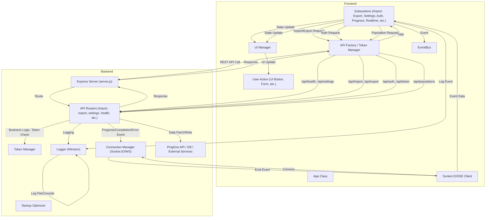

# Application Frontend-Backend Flow Documentation

---

## 1. Frontend-Backend Flow Diagram

---

## 2. Printable Step-by-Step Flow Breakdown

### 2.1 User Action → API Request → Response
1. **User Action:** User clicks a button or submits a form in the UI.
2. **App Class:** The main App class receives the event and delegates to the relevant subsystem (e.g., ImportSubsystem).
3. **Subsystem:** The subsystem prepares the request data and calls the API Factory/Token Manager.
4. **API Factory/Token Manager:** Adds authentication tokens and sends a REST API request (e.g., POST `/api/import`) to the backend.
5. **Express Server:** Receives the request and routes it to the correct API router.
6. **API Router:** Validates the request and token, performs business logic, logs the request, and interacts with external services if needed.
7. **Response:** The backend sends a JSON response back to the frontend.
8. **Frontend Handling:** The subsystem receives the response, updates state, and triggers UI updates.

### 2.2 Real-Time Progress/Status Updates
1. **Operation Start:** User triggers an operation (e.g., import) via the UI.
2. **API Request:** The frontend sends a request to start the operation.
3. **Backend Processing:** The backend starts processing and emits progress/completion/error events via Socket.IO or SSE.
4. **Socket.IO/SSE Client:** The frontend’s real-time subsystem listens for these events.
5. **Subsystem Update:** The relevant subsystem receives event data and updates its state.
6. **UI Update:** The UI Manager updates progress bars, status messages, and notifies the user in real time.

### 2.3 Settings/Health/Population Fetch
1. **User Action:** User navigates to settings or population UI.
2. **Subsystem Request:** The SettingsSubsystem or PopulationSubsystem requests data via the API Factory.
3. **API Call:** GET `/api/settings`, `/api/populations`, or `/api/health` (Token Manager adds authentication).
4. **Backend:** API router fetches data from config files, DB, or external APIs and returns the requested data.
5. **Frontend Handling:** Subsystem receives data and populates the UI.

### 2.4 Authentication/Token Management
1. **User Action:** User logs in or triggers an action requiring authentication.
2. **AuthSubsystem:** Handles login, logout, and token refresh logic.
3. **API Factory/Token Manager:** Requests new tokens from `/api/auth` or `/api/token` and manages tokens for future API calls.
4. **Backend:** Validates credentials, issues or refreshes tokens, and returns token data.
5. **Frontend Handling:** Stores tokens securely and updates UI to reflect authentication state.

### 2.5 Logging and Error Reporting
1. **Subsystem Event:** Any subsystem or the App class logs an event or error.
2. **Frontend Logging:** Uses LoggingSubsystem or window.logManager; optionally sends logs to backend via `/api/logs`.
3. **Backend Logging:** Winston logger writes logs to files and/or console; logs are rotated, compressed, and separated by component.
4. **UI Feedback:** Errors and important events are shown to the user via the UI Manager.

### 2.6 Population/Export/Import/History Flows
1. **User Action:** User triggers export, import, or history view.
2. **Subsystem:** Prepares request and calls API Factory.
3. **API Call:** POST `/api/export` or `/api/import`, GET `/api/history`.
4. **Backend:** API router processes request, interacts with PingOne API or DB, emits real-time events for progress, and returns data or download link.
5. **Frontend Handling:** Subsystem updates UI, downloads files, or displays history.

---

## 3. Summary Table

| Flow Type         | Frontend Trigger         | API Endpoint(s)         | Real-Time? | Backend Module(s)         | UI Update Location      |
|-------------------|-------------------------|-------------------------|------------|---------------------------|------------------------|
| Import/Export     | Button/Form             | /api/import, /api/export| Yes        | import.js, export.js      | Progress bars, status  |
| Settings/Health   | Navigation/Load         | /api/settings, /api/health, /api/populations | No | settings.js, health.js, populations.js | Settings, dropdowns   |
| Auth/Token        | Login/Token Expiry      | /api/auth, /api/token   | No         | credential-management.js  | Login/logout, status   |
| Progress/Status   | Long-running operation  | (Socket.IO/SSE)         | Yes        | connection-manager.js     | Progress, notifications|
| Logging           | Any event/error         | /api/logs (optional)    | No         | winston-config.js         | Console, log files     |
| History           | View history            | /api/history            | No         | history.js                | History table/list     |

---

*This document provides a full printable and shareable breakdown of all major frontend-backend flows in the application, including a visual diagram and step-by-step explanations.*